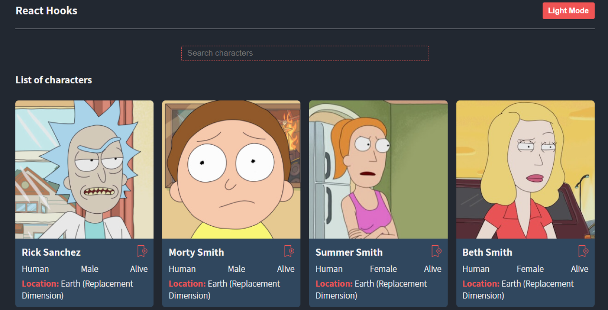

# Rick and Morty landing page

Project built with React that lists the most important characters in Rick and Morty TV show . Also, you can add to favorites each character and switch to light and dark mode. 
This project is a React Hooks practice.

## Preview 🖼

## Demo 💻

If you want to see the demo, you can visit this link. **[Demo of the project](https://rick-and-morty-landing-p-e6fe4.web.app/)**

## Pre requirements 📋

To run this project or you want to modify something, you needed the next points
- A browser.
- A code editor as Visual Studio Code, Atom, Sublime Text, among others.
- Have npm and Git installed.

## Installation - How to clone 🚀

To install and run this project you can to do with __git clone__
- With HTTPS
~~~
https://github.com/mxrold/rick-and-morty-landing-page.git
~~~
- With SSH
~~~
git@github.com:mxrold/rick-and-morty-landing-page.git
~~~

_Not sure how to clone a project? **[Check this](https://github.com/mxrold/how-to-clone-a-repository-in-github/blob/main/README.md)**_

## Building with 🛠️

- HTML
- CSS
- React
- API [The Rick and Morty API](https://rickandmortyapi.com/)
